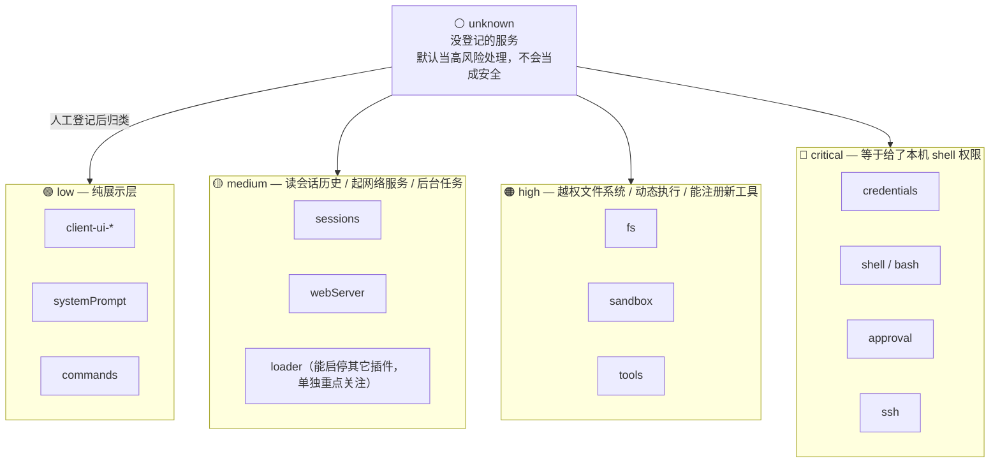
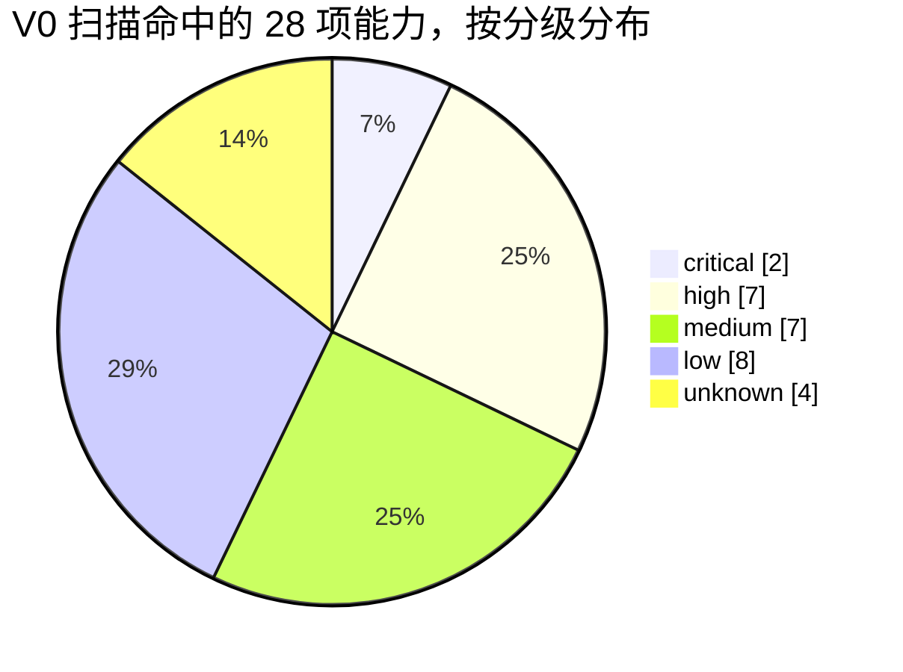

# dsh-capcheck

看一个 DSH 插件装上之后实际能碰到你机器上的什么 —— 纯静态分析，不执行插件代码。

## 例子

```
$ node bin/cli.js <本地已装的 dsh-ssh 插件目录>

  [HIGH]  tools        (declared=true)
  [MEDIUM] webServer   (declared=true)
  [LOW]   systemPrompt (declared=true)
```

这个插件全程没有声明或引用 ctx.shell / ctx.sandbox / ctx.approval。它的 SSH 命令执行走的是自己内置的 ssh2 库，绕开了 DSH 官方的审批和沙箱——能执行远程命令这件事，对官方的安全机制来说是看不见的。

## 目前扫到的几个例子

- dsh-ssh：如上，远程命令执行绕过了官方审批。
- dshmarket（插件市场）：通过 ctx.inject(['loader'], ...) 拿到了 cordis Loader 的控制权，理论上可以静默启停机器上任何其它插件。目前扫到权限最重的一个。
- dsh-provenance、dsh-plugin-check、dsh-egress-guard 这几个做安全体检的插件，自己也都注册了新的 agent 工具。

完整的扫描方法和数据在 reports/ecosystem-capability-landscape-v0.md。

## 用法

命令行：

```sh
node bin/cli.js <本地插件目录>       # 扫一个已经装在本机的插件
node bin/batch-npm.js <npm包名>     # 扫真实发布的 npm tarball，推荐用这个
```

也可以直接装成 DSH 插件：

```sh
dsh plugin --profile web add dsh-capcheck
```

装好之后可以直接让模型帮你查，比如问它"用 dsh_capcheck 看看这个插件装了会碰到什么"。已经在 headless profile 里跑通过，模型能正确调用工具并给出结构化结果。

## 背景

DSH 的 cordis 插件本质上就是普通的 Node 模块，直接跑在宿主进程里，没有权限沙箱这一层——官方文档里写的原话是把动态插件当成 bash access 来对待。也就是说一个插件装进去之后，理论上能碰到你的 API Key、能执行命令、能绕开审批。dsh-capcheck 做的事情是在你安装之前，先看看这个插件的代码里声明或引用了哪些敏感能力。

## 能力分级表

这张表是整个项目的核心，三种检测信号最终都会往这张表上查。分级逻辑是一个梯子，越往上代表插件拿到之后能造成的破坏越大：



实际扫描时命中的能力也会按这五档统计，V0 阶段扫过的 18 个插件（4 个官方包 + 14 个真实发布的社区插件）一共命中了 28 项能力，分布是这样：



表本身在 data/capability-tiers.yaml，纯文本可以直接编辑，欢迎针对没登记的服务提 PR。

## 怎么检测

三种信号，按可信度从高到低：

1. inject 数组声明。cordis 框架自带的依赖注入机制，static inject = [...] 这种写法，是框架强制要求的，可信度最高。
2. 裸成员访问，比如 ctx.credentials、ctx.shell。只认对象字面上是 ctx 或 context 的情况，避免误判——之前踩过一个坑，某插件里 client.shell(...) 其实是第三方 ssh2 库自己的方法，跟 ctx.shell 完全无关，后来加了这个限制才排除掉。
3. package.json 里的依赖声明，不用下载代码就能先粗筛一轮。

三种信号命中的服务名都会去查上面那张能力分级表。

## 局限

- 直接扫 GitHub 仓库经常扫不到东西，因为很多插件的构建产物只在发布时打进 npm tarball，没有提交到 git。实测样本里这个情况出现的概率超过一半，所以推荐用 bin/batch-npm.js 扫真实发布的 tarball。
- package.json 的 main/exports 字段写法很不统一，很多插件只写 exports 而且形状还不一样，已经在 src/resolve-entry.js 里做了兼容处理。
- 裸成员访问检测是启发式的，检测不到经过改名或者解构之后的访问。
- 能力分级表目前只覆盖了官方包和几个比较知名的第三方服务，其它一律 unknown，需要持续补充。
- 还没有做动态验证。一个存心要绕过检测的插件完全可以不声明 inject，靠间接方式拿到引用，这种情况只有真的把插件加载起来、用 Proxy 记录实际访问才能抓到。

## 目录结构

```
src/extract-inject.js   静态分析，提取 inject 声明和裸成员访问
src/resolve-entry.js    解析 package.json 的 main/exports
src/tiers.js            读取能力分级表
src/scan-package.js     扫本地已装目录
src/scan-npm.js         扫真实发布的 npm tarball
src/scan-remote.js      扫 GitHub 仓库内容（不太可靠，见上面局限）
src/plugin.js           DSH 插件外壳，注册 dsh_capcheck 工具
bin/cli.js / batch.js / batch-npm.js   命令行入口
data/capability-tiers.yaml   能力分级表
reports/                 扫描报告
```

## 现状

本地扫过 4 个官方 @deepseek-ai/dsh-* 包，用真实 npm tarball 扫过 15 个已发布的社区插件，14 个成功（唯一失败的 petdex 是因为它的 package.json 既没写 main 也没写 exports，报告里标成了扫描不完整，不会当成安全）。

## License

MIT
